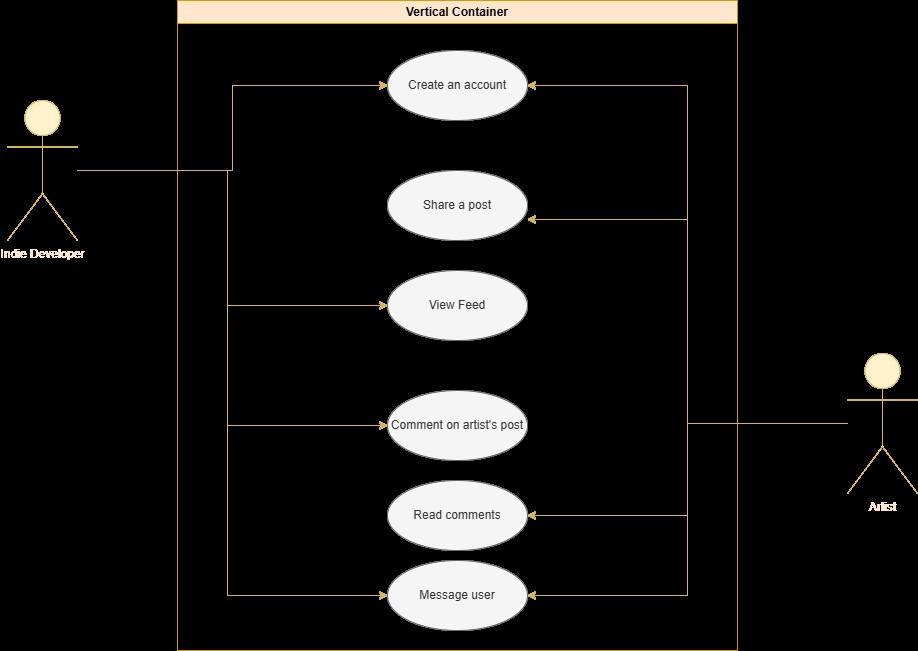

# Overview
  Chrova, or Chrova Social, is a social media application which may be similar to several, such as Instagram and Bluesky. The difference in this one, however is that it will be designed and marketed with small artists in mind. As an artist myself, there is something to be said about a safe space to share your art and connect with others who are like-minded.
## Components
This site will be composed of several smaller components. <ins>Please see attached diagram for links between these components:</ins>
- External database for storing account and contact information
- Ajax system to send and retrieve data
- Web server for hosting
- App UI
- API Gateway
- Internal database for storing the user account's post

## Wireframe Sketches
  Attached below are the wireframe sketches for each of the main pages and functions for the application. These will change slightly with window resizing and mobile adaptation, but the layout will remain relatively the same.
  

## User Stories
1. "As a small aspiring artist, I need a space to share my work with like-minded individuals so that I can grow my exposure and share my hobby."
2. "As a tattoo apprentice, I need a website to advertise my work so that I can have opportunities for practice and constructive feedback."
3. "As a disabled artist, I need a place to share my arts and crafts for sale so that I can gain customers and support myself."
4. As an art collector, I desire website where I can find artists that can interpret my ideas and create pieces for my collection."
5. "As an independent game developer, I need a site to find talended artists to hire to create art for my game idea."

## Use-Cases
1. Small Artist
   - System: An image sharing website.
   - Actor: A small artist who wants to share their hobby.
   - Goal: To share their art with people who will appreciate it and provide support.
   - Scenario: The user navigates to the site or app and decides to create an  account. They navigate to the Register page and enter their information, which is then stored in the database. After they click "Register" at the bottom of the form, they are taken to their home page. The user can then navigate to the page to add a new post, and begin sharing their work.
2. Tattoo Apprentice
   - System: An image sharing website.
   - Actor: A tattoo apprentice.
   - Goal: To share their work and advertise to get clients for practice and to expand their portfolio.
   - Scenario: The user navigates to the site and decides to create an account. Once they navigate to the registration page and enter their account information, they will be directed to their home page and can then post their art with a caption or message advertising their work. They can include their contact information so that prospective clients who view their work can then message them and schedule appointments. 
3. Disabled Artist
    - System: An image sharing website
    - Actor: A disabled artist.
    - Goal: To advertise their work for sale to a community who will be interested in purchasing it.
    - Scenario: The artist and crafter cannot perform regular physical job duties, and wishes to make a living out of their hobbies of making art and crafting handmade items. They discover the website/application and decide to sign up for an account. After registering, the artist can share their work through posts and advertise them. They can add captions to the images, giving information about the products such as the materials they are made out of, the quantity for sale, and the price. Customers who are interested can comment or message the artist.
4. Art Collector
   - System: An image sharing website.
   - Actor: An art collector.
   - Goal: To find original art pieces for purchase.
   - Scenario: A collector registers for an account on the site, and is taken to the home page where they will be shown a feed of suggested posts. They can also search for users and for tags on art that they are interested in. After finding a post that they like and wish to purchase, they can then leave a comment on the post or message the artist directly and inquire about a purchase.
5. Independent Game Developer
   - System: An image sharing website.
   - Actor An independent game developer.
   - Goal: To find independent artists with the skills to create game art in the style the developer envisions for their game.
   - Scenario: An indie game developer with ample experience in coding but none in art decides to register for an account with the image sharing site. After registering and being brought to their home page, they can do a couple of things. First, they can share an image of their game's code or the title, and advertise that they are looking to hire independent artists. Artists who are interested in the job can comment or message the developer. Secondly, the developer can also find artists in their feed or by search that match the style they want, and can either comment or message the artists to offer them the gig.
## UML Diagram

## Table of Requirements

| ID | Requirement |
| -- | ----------- |
| 1  | The software shall allow the user to log in with their existing username/password, and direct to the home page. |
| 2  | If the credentials do not exist, the software shall display an error message and direct to the register page. |
| 3  | The software shall connect to Google JavaScript API to authenticate the credentials. |
| 4  | The software shall allow the user to upload images and share them the site. |
| 5  | The software shall allow users to add keywords to posts and search posts based on them. |

