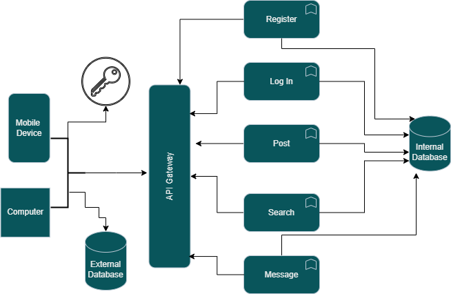
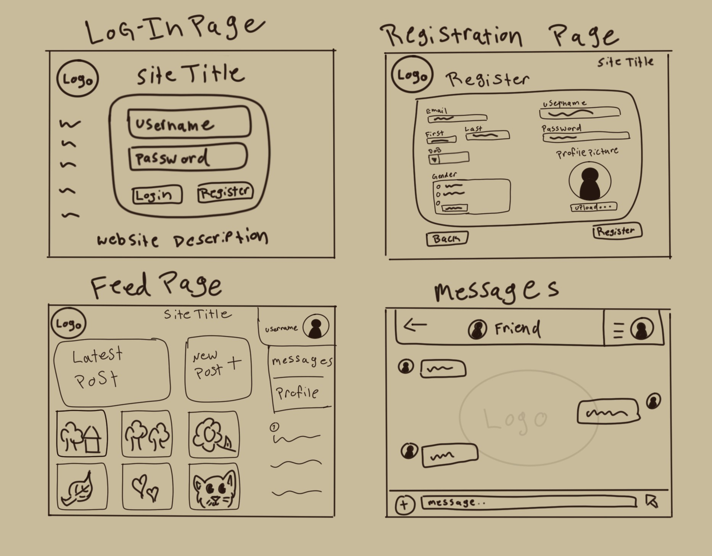

# Overview
  Chrova, or Chrova Social, is a social media application which may be similar to several, such as Instagram and Bluesky. The difference in this one, however is that it will be designed and marketed with small artists in mind. As an artist myself, there is something to be said about a safe space to share your art and connect with others who are like-minded.
## Components
This site will be composed of several smaller components. <ins>Please see attached diagram for links between these components:</ins>
- External database for storing account and contact information
- Ajax system to send and retrieve data
- Web server for hosting
- App UI
- API Gateway
- Internal database for storing the user account's post

## Wireframe Sketches
  Attached below are the wireframe sketches for each of the main pages and functions for the application. These will change slightly with window resizing and mobile adaptation, but the layout will remain relatively the same.
  
