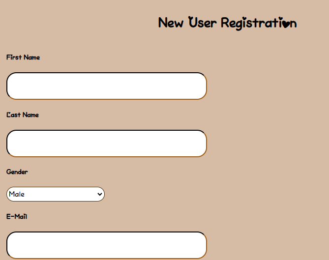

# Prototype Overview
This prototype is a basic skeletal layout of the final site. It is mostly used to capture the overall look and feel of the site, and to show how one will navigate it. 

# Log In Page
This is a basic HTML/CSS mockup of the log in page. This will be the index.html page of the website, what each user will see upon opening the website for the first time. It has the logo, a field for the username and password, and a log in/submit button. There is also a link to the registration page for new users.

# New User Registration
This is the new user registration page. New users will navigate here from the log in page if they do not already have an account to log in to, or if they wish to make an additional account. The registration page will be where the users input all of their information such as first and last name, e-mail address, preferred gender, username/password combination, and profile picture.

# User Home Page
This is the user's home page. It will show when the user logs in, whether a new user who has just registered, or an existing user. It will show the user's profile picture in the top right along with their username underneath. The content to the left will be a feed of other users' posts, and the content to the right will be the navigation menu for the user to choose what they would like to do. This menu will include an option to view the user's own posts, to create a new post, and to view their messages/

